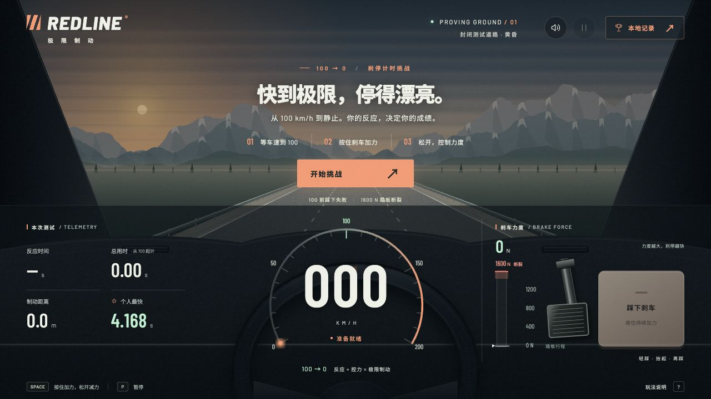
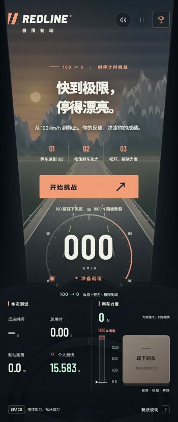

# REDLINE · 刹车大师

参考 [breakbreak.app](https://breakbreak.app/) 的刹停计时玩法制作的独立网页小游戏。

## 运行截图

桌面端：



手机端：



## 网站集成与发布

游戏来源于 `bufan1024/redline-brake-game`，导入版本为 `796ef1598571b4b1ebcbc447fd0146e19b7810de`。

本项目通过 `https://hangyejiadao.vip/zunjie` 访问游戏，目录请求会自动跳转到 `/zunjie/`。浏览器模块使用 `.js`，以兼容现有 ASP.NET Core 静态文件服务。

推送 `zunjie/**` 的修改到 `master` 会触发主仓库的 `Deploy Redline Game` 工作流：运行物理测试，只发布 HTML、CSS、JavaScript、图标和版本信息到服务器 `$DEPLOY_PATH/appwwwroot/zunjie`。`DEPLOY_PATH` 默认 `/home/work/myblogs`，复用现有 `SERVER_HOST`、`SERVER_USER`、`SERVER_SSH_KEY` 和可选 `SERVER_PORT` Secrets。也可以在 Actions 页面手动运行。

发布完成后工作流会校验页面和 JavaScript 模块的 HTTP 状态与 MIME 类型。版本信息位于 `/zunjie/version.json`。无需安装 Node.js 到线上服务器或重启后端。

运行 `npm run build` 可生成 `_site/` 静态发布包，包内的资源引用带有版本参数，更新后会获取新资源。

## 启动

不需要安装依赖，需要 Node.js 18 或更新版本：

```sh
npm start
```

打开 http://127.0.0.1:4173。可以用 `PORT=8080 npm start` 更换端口。

## 玩法

- 点击「开始挑战」，倒计时后车辆自动加速。
- 首次达到 100 km/h 时开始计时，提前刹车会失败。
- 按住屏幕踏板或空格增加力度，松开后力度逐渐回落。
- 控制力度在 1600 N 以下，尽快刹停到 0。总成绩包含反应时间。
- `R` 重试，`P` / `Esc` 暂停，`M` 切换声音。切换窗口自动暂停。

成功成绩保存在当前浏览器的 localStorage，显示本地 TOP 50 和个人最佳。没有全球榜单或线上提交。

## 验证

```sh
npm test
```

游戏使用原生 HTML、CSS、JavaScript、Canvas 与 Web Audio，赛道动画和驾驶舱由代码绘制。字体由 Google Fonts 提供，离线时使用本机字体。物理为游戏化简化模型。

已验证 13 项物理测试；在浏览器中完成倒计时、提前刹车失败、1600 N 踏板断裂、真实键盘控力停车、成绩保存与刷新恢复、暂停／继续、说明弹窗以及 390×844 和 375×667 手机布局检查。浏览器实测一次正常刹停为 4.168 秒，反应时间 0.081 秒，峰值力度 1354 N。
